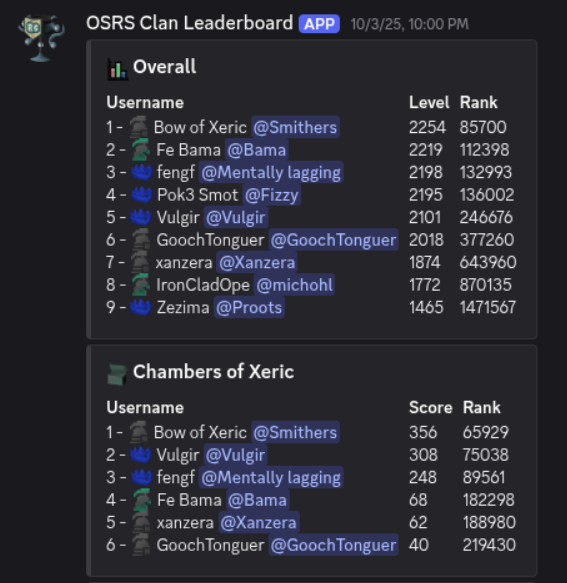
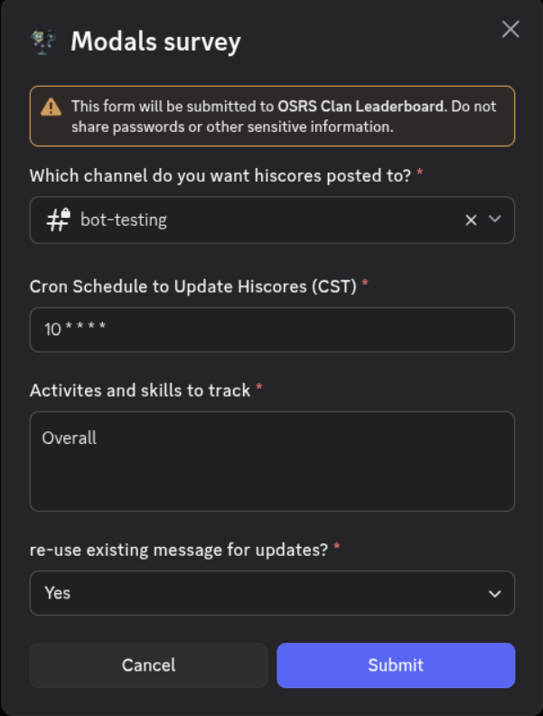

# OSRS Clan Leaderboard

This project is meant to be a simple Discord bot that will keep track of a list of
OSRS usernames and a list of desired skills/activities to keep track of then
maintain a message in a discord channel that will display a ranking of each hiscore
ranking only the enlisted users.

## How to Enroll Your Discord Server?

### Add the Application to the Server

You can add this application to your server by using the following invite link: https://discord.com/oauth2/authorize?client_id=1418042803719639112

### Tweak Permissions

Once the application is added you may have to tweak either server permissions or channel
permissions to allow the bot to post/edit messages.

### Configure the Server Settings

From any channel in the server you can use the command `/configure` to update all the server specific settings required to begin posting hiscores messages.
You will need the following settings filled out:

> Which channel do you want hiscores posted to?

This should be any channel in your server that this bot has permissions in.

> Cron Schedule to Update Hiscores (CST)

This is how we tell the bot how often you want your message to be updated or reposted.

If you are unfamiliar with "cron" you can use https://crontab.guru/
to build a cron expression that meets your specific desires.

> Activities and skills to track

This is a **comma separated list** of activities that you want to track.

To find a complete list of options refer to the official hiscores API list of skills
and activities: https://runescape.wiki/w/Application_programming_interface#Old_School_Hiscores

> re-use existing message for updates?

This can only be `Yes` or `No`. If the value is set to `Yes` then the bot will post
a new message once and then every time it would post from there on out it will edit the
existing message rather than posting a new one every time.

## How to Add New Users to be Tracked

Any user from any channel can use the command `/assign` to add their OSRS user to the list
of users that will be reported on in the final hiscores message. This command requires the
following input:

* Discord Username **(Has select menu)**
* OSRS Username
* OSRS Account Type (Main, Ironman, Hardcore Ironman, etc.) **(Has select menu)**

The command will provide helpful fields that will provide valid choices for you.

## How to Post a New Hiscores Message

If you would like to instantly post a new message or "refresh" the existing message without
waiting until the next scheduled update you can use the command `/post` to invoke a message
update manually.

## I Think the Bot is Broken. How do I Check?

You can use the command `/ping` to send a request to the bot. If it is up it will respond
to you with a "pong" message confirming the bot is at minimum running.

If you suspect further issues you can report issues directly to me on Discord @michohl or
you can open an issue here on Github: https://github.com/michohl/osrs-clan-leaderboard/issues
